# AI-Art Forensics

An experimental forensic pipeline for studying whether visual features in art images are associated with human-made artwork or images generated by diffusion models.

The project uses frozen OpenAI CLIP ViT-B/32 embeddings, a linear logistic-regression probe, UMAP visualisation, gradient-based saliency maps, and adversarial evaluation. A Streamlit app packages the trained classifier into an interactive image-analysis demo.

> **Important:** This is a research and demonstration tool, not a provenance verifier. Its predictions are dataset-dependent and should not be treated as definitive evidence about how an image was created.

## Demo

Run the Streamlit application from the repository root:

```bash
streamlit run streamlit_app/app.py
```

The app accepts JPG, PNG, and WEBP images. It returns:

- a Human-Made or AI-Generated verdict with class probabilities;
- a CLIP gradient-saliency overlay;
- the image's location in a cached UMAP reference space;
- technical details including the model, embedding norm, and device.

The first run downloads/loads CLIP and fits the cached UMAP reference reducer. The current app is configured to run CLIP on CPU.

## Research question

Can a frozen vision-language representation linearly separate human artwork from AI-generated artwork, and what does that separation actually capture?

The notebooks investigate four connected questions:

1. What distributional and frequency-domain differences exist between the image sources?
2. Do 512-dimensional CLIP embeddings separate human and AI images without fine-tuning CLIP?
3. Does the classifier generalise across diffusion generators, styles, and difficult examples?
4. Which image regions and embedding dimensions are associated with the classifier's decision, and how does the decision change under adversarial perturbations?

## Main findings

The current analysis reports:

- **99.49% clean accuracy** for the binary probe on the evaluated test split.
- Human, latent-diffusion, and standard-diffusion images form visibly different regions in CLIP embedding space.
- **Cross-generator transfer is weak:** a classifier trained on latent-diffusion images reaches approximately **51.5%** on held-out standard-diffusion images.
- Surrealism and ukiyo-e are among the more difficult styles in the per-style analysis.
- Pixel-space attacks reduce performance, while adversarial training improves robustness at an observable cost to clean accuracy.
- Saliency and embedding-dimension probes are useful explanations of model behaviour, but they are not causal proof of an image's origin.

The exact values belong to the saved experiment outputs and can vary with the split, preprocessing, library versions, or regenerated artifacts.

## Pipeline

```text
Dataset manifest
	|
	v
CLIP ViT-B/32 image encoder
	|
	v
512-dimensional L2-normalised embeddings
	|
	+--> Logistic regression probe --> Human / AI probability
	|
	+--> UMAP --> 2D embedding-space visualisation
	|
	+--> Input gradients --> CLIP saliency map
	|
	+--> FGSM / PGD evaluation --> robustness analysis
```

The bundled Streamlit classifier loads `streamlit_app/models/classifier.joblib`. The app's UMAP view loads the 5,000-image reference sample from `streamlit_app/models/umap_embeddings_sample.npy` and `streamlit_app/models/umap_meta_sample.csv`.

## Research figures

The figures below are the important visual checkpoints for a project report or presentation. They are kept in `figures/` so the README can be read as a visual summary of the work.

### Embedding space and classification

<!-- Picture placeholder: overview of the CLIP embedding space. -->

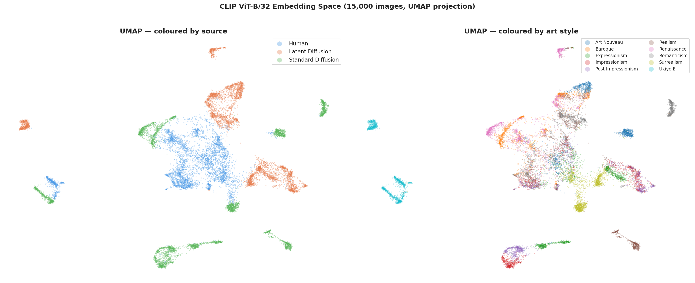

<!-- Picture placeholder: confusion matrix and ROC curve. -->

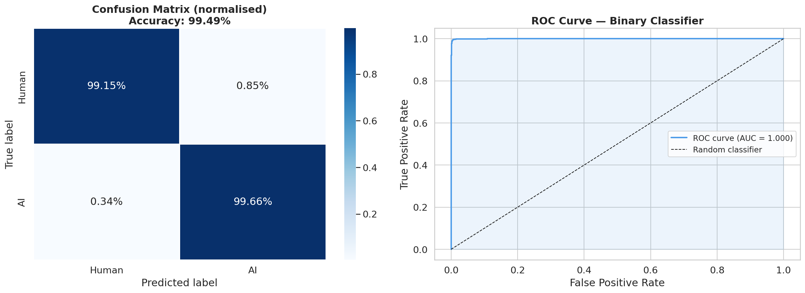

<!-- Picture placeholder: accuracy across art styles. -->

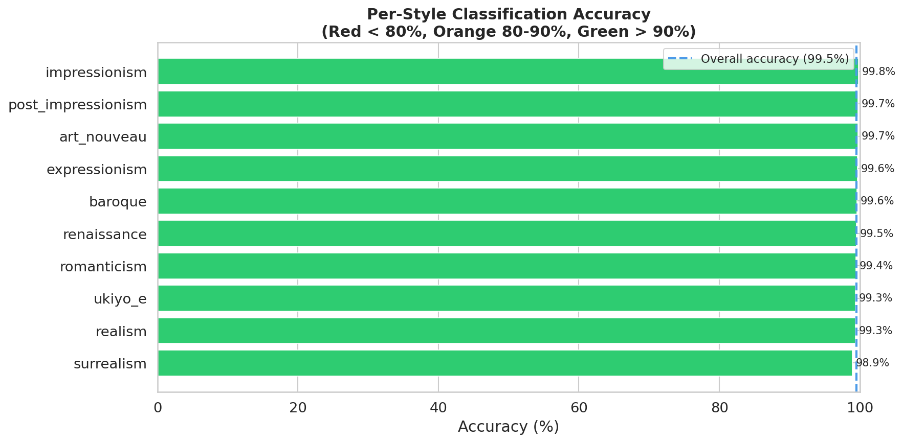

<!-- Picture placeholder: cross-generator generalisation. -->

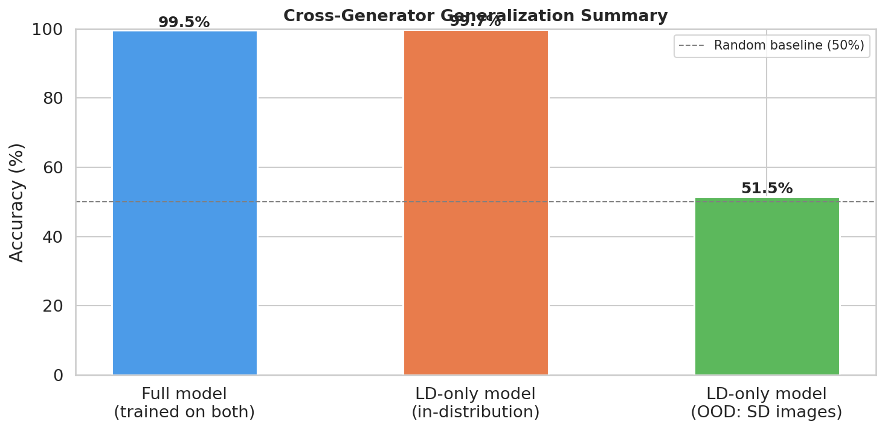

### Explainability

<!-- Picture placeholder: CLIP saliency overlays. -->

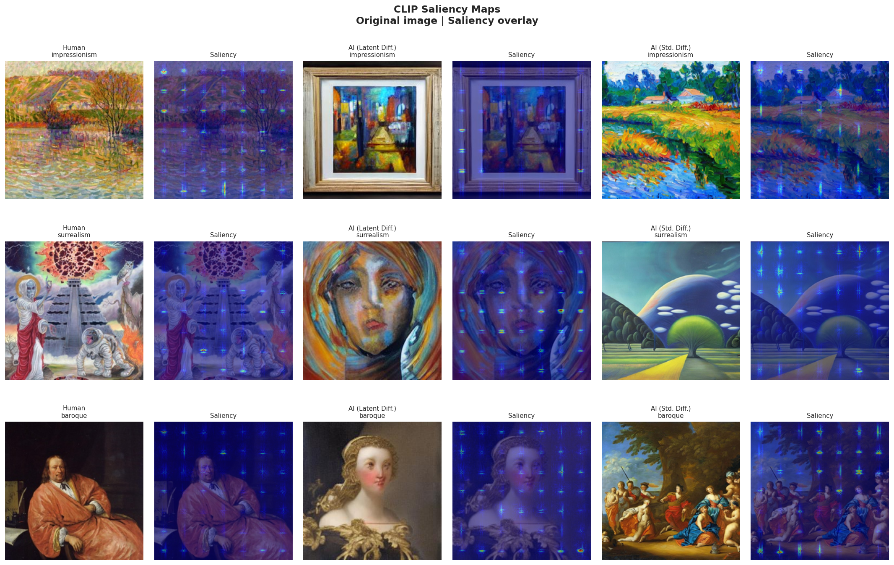

<!-- Picture placeholders: confident and ambiguous examples. -->

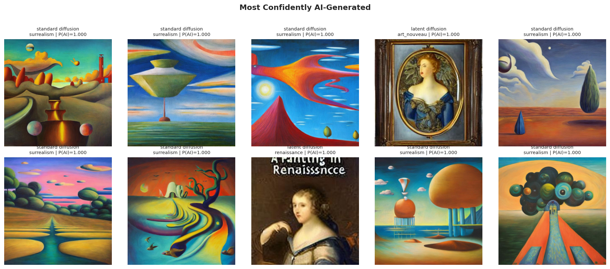

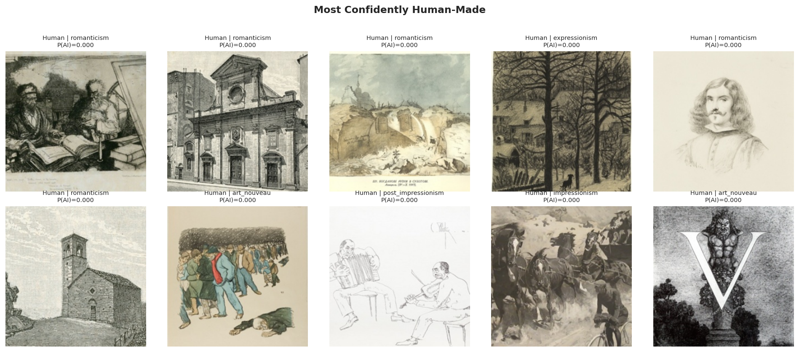

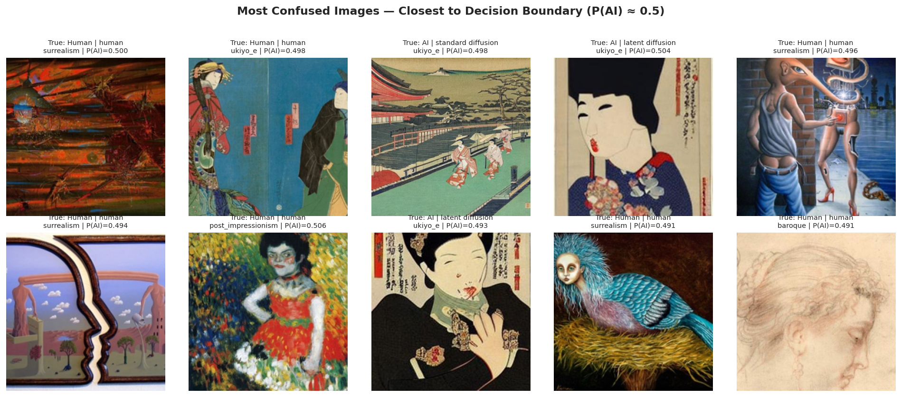

<!-- Picture placeholder: distribution of linear-probe weights. -->

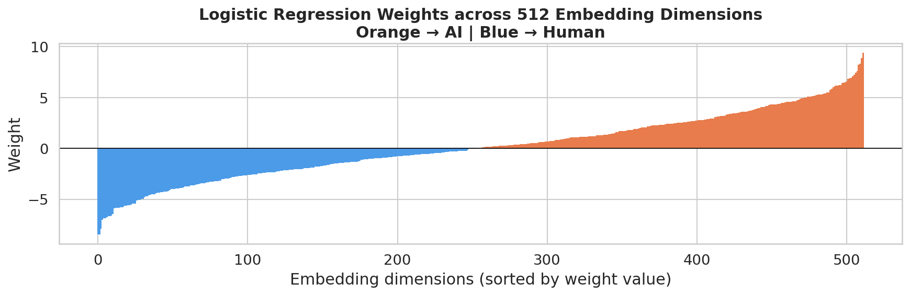

<!-- Picture placeholders: visual probes of the most influential embedding dimensions. -->

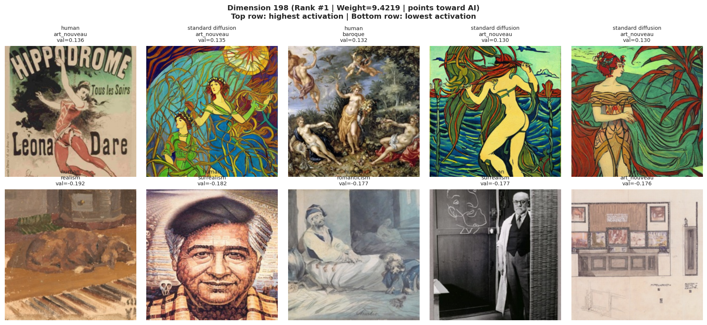

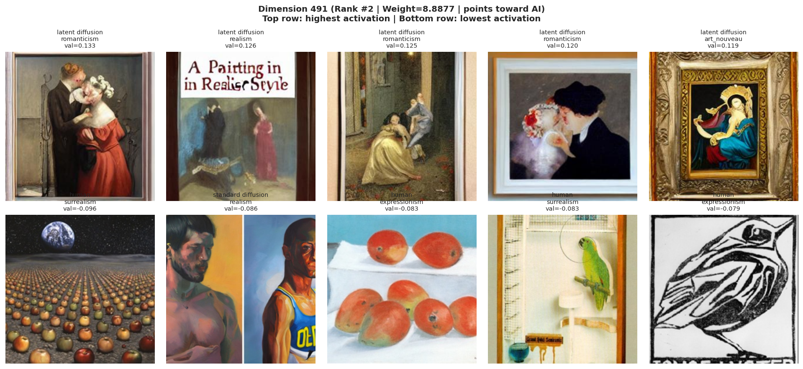

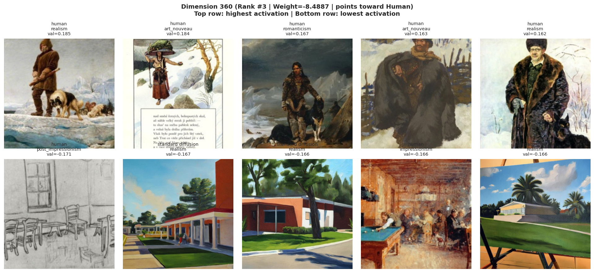

### Adversarial robustness

<!-- Picture placeholder: accuracy as perturbation strength increases. -->

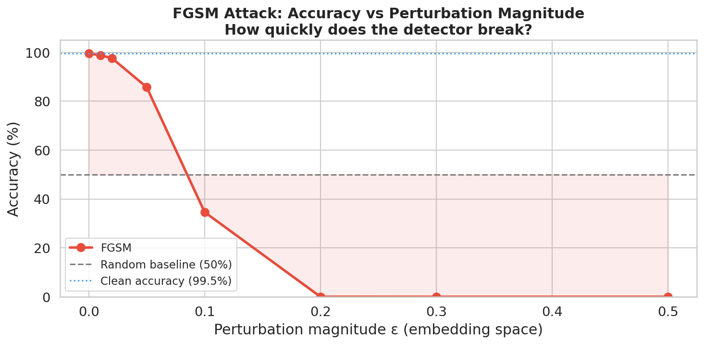

<!-- Picture placeholder: FGSM versus PGD comparison. -->

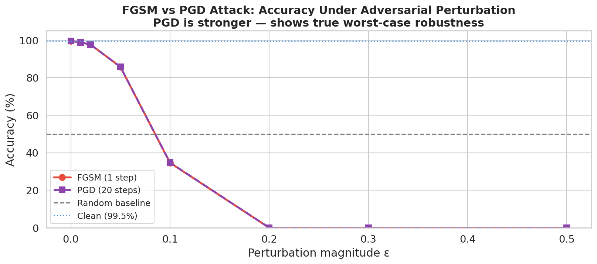

<!-- Picture placeholder: examples of adversarially perturbed images. -->

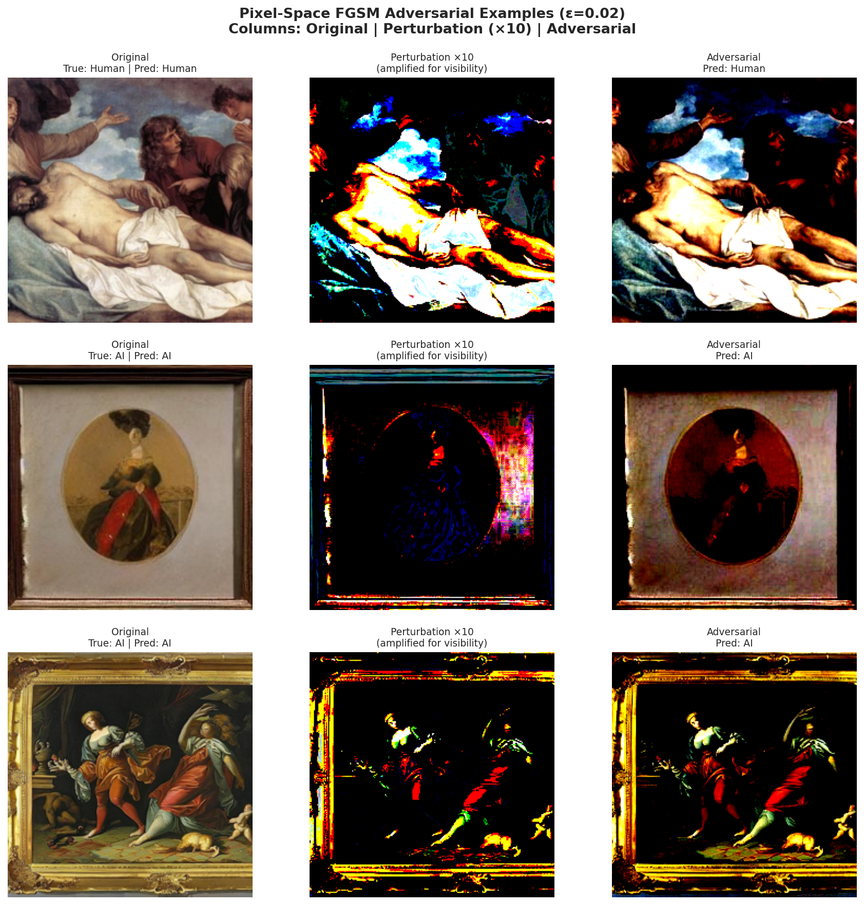

<!-- Picture placeholder: clean and robust accuracy after adversarial training. -->

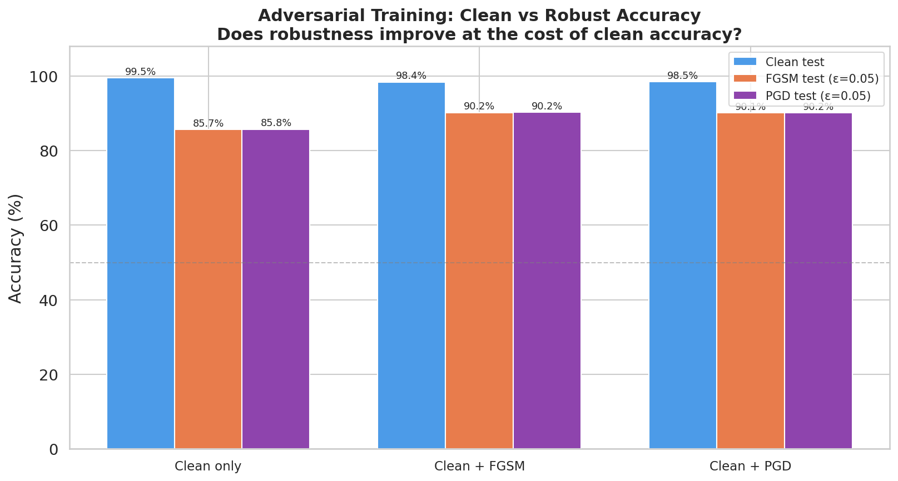

## Repository map

```text
.
|-- dataset_manifest.csv                 # 185,015-image manifest
|-- figures/                             # exported research figures
|-- notebooks/
|   |-- exploratory-data-analysis.ipynb  # dataset construction and EDA
|   |-- clip-embedding-extraction.ipynb  # CLIP feature extraction
|   |-- embedding-analysis.ipynb         # UMAP, probe, metrics, transfer
|   |-- explainability.ipynb             # saliency and dimension probes
|   `-- adversarial-robustness.ipynb     # FGSM, PGD, and robust training
|-- streamlit_app/
|   |-- app.py                           # interactive demo
|   `-- models/                          # classifier, embeddings, metadata
|-- outputs/                             # reserved for generated outputs
`-- requirements.txt                     # dependency manifest
```

`src/` and `outputs/` are currently empty. The repository also contains a local `streamlit_app/venv/`; it is an environment directory rather than project source and is intentionally omitted from the map above.

## Data and artifacts

The manifest contains 185,015 records with these fields:

| Field      | Description                                          |
| ---------- | ---------------------------------------------------- |
| `path`     | Original image path used during notebook execution   |
| `split`    | `train` or `test`                                    |
| `source`   | `human`, `latent_diffusion`, or `standard_diffusion` |
| `style`    | One of 10 art styles                                 |
| `label`    | `0` for human, `1` for AI                            |
| `filename` | Original image filename                              |

The original image dataset is referenced through external `/kaggle/input/...` paths in the manifests; the source image collection itself is not included here. The repository does include the derived embedding and classifier artifacts used by the demo:

- `embeddings.npy`: shape `(185015, 512)`;
- `metadata.csv`: embedding metadata and source labels;
- `classifier.joblib`: scikit-learn logistic-regression probe;
- `umap_embeddings_sample.npy`: shape `(5000, 512)`;
- `umap_meta_sample.csv`: metadata for the UMAP reference sample.

## Notebooks

Run the notebooks in this order when reproducing the analysis:

1. `exploratory-data-analysis.ipynb`
2. `clip-embedding-extraction.ipynb`
3. `embedding-analysis.ipynb`
4. `explainability.ipynb`
5. `adversarial-robustness.ipynb`

The notebooks were developed around a Kaggle-style dataset layout and may require updating `DATA_DIR`, `OUT_DIR`, and image paths for a different machine. `requirements.txt` is currently empty, so install the dependencies used by the notebooks and app in the active environment before running them. The observed stack includes Python, PyTorch, OpenAI CLIP, NumPy, pandas, Pillow, Matplotlib, seaborn, scikit-learn, UMAP, joblib, tqdm, and Streamlit.

## Limitations

- The model learns correlations in one benchmark and may recognise generator or dataset signatures rather than a universal concept of AI authorship.
- Cross-generator results show that out-of-distribution performance can approach chance.
- Style, compression, resizing, post-processing, and image provenance can all affect the result.
- Saliency maps show input sensitivity, not human-interpretable reasoning.
- The bundled serialized model was created with scikit-learn 1.6.1 and may emit a version warning under other scikit-learn releases.
- A high-confidence prediction is not evidence of intent, authorship, or copyright status.

## License and attribution

Add the dataset citation, CLIP attribution, and project license here before publishing or redistributing the repository.
